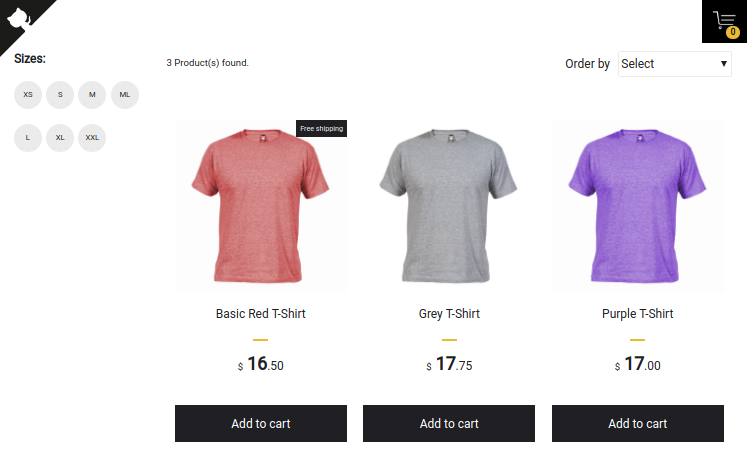

# Simple Shopping Cart<br>

<p align="center">
  
</p>

## Overview

This simple shopping cart repurposes the excellent work done by the original
author of this React based app.  This repo adds additional testing tools and
frameworks along with a plain looking t-shirt catalog.  The intended use of
this repo is researching and evaluating testing solutions.

## Features

- Add and remove products from the floating cart
- Sort products by highest to lowest and lowest to highest price
- Filter products by available sizes
- Products persist in floating cart after page reloads
- Unit tests, integration tests and e2e testing
- Responsive design

## Build/Run

### Requirements

- Node.js
- NPM
```
/* First, Install the needed packages */
npm install

/* Then start both Node and React */
npm start

/* To run the tests */
npm run test

/* Running e2e tests */
npm run wdio
```
### Configure

Edit the .env files to change URLs etc.

## About tests

- Unit tests
  - All components have at least a basic smoke test
- Integration tests
  - Fetch product and add to cart properly
- e2e
  - Webdriverio - Add and remove product from cart

## License

This project is licensed under the MIT License - see the [LICENSE.md](LICENSE.md) file for details
